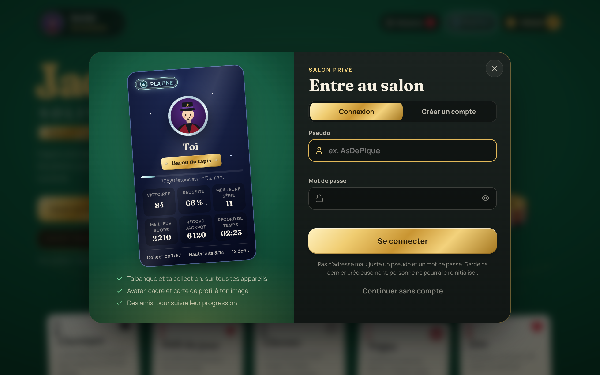
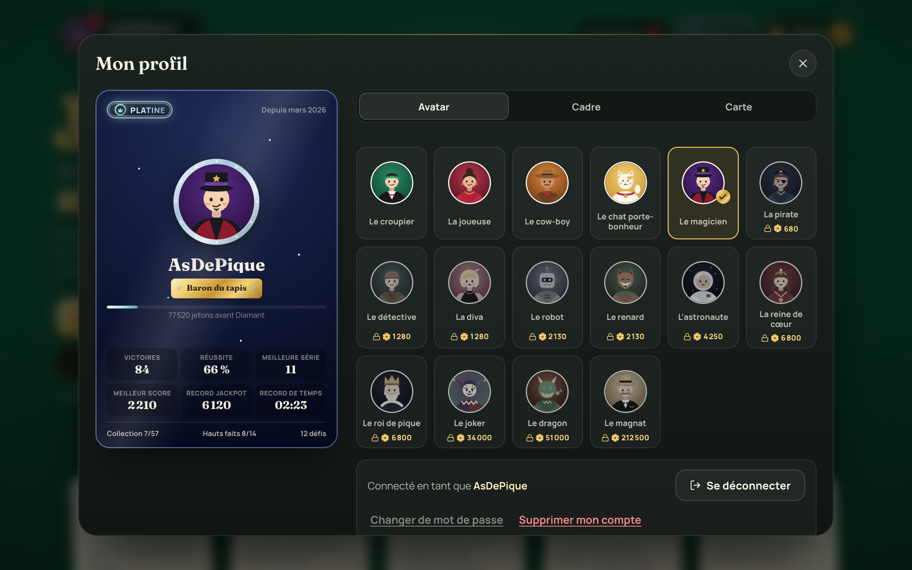
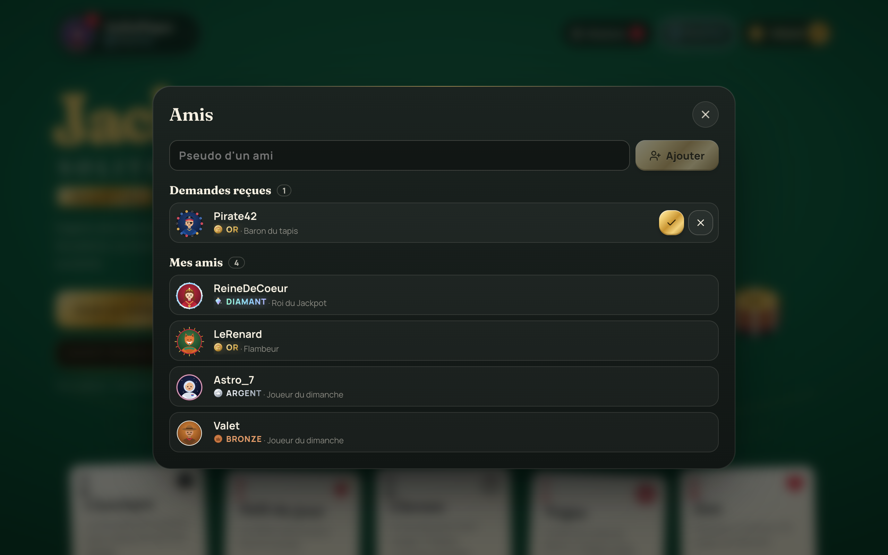
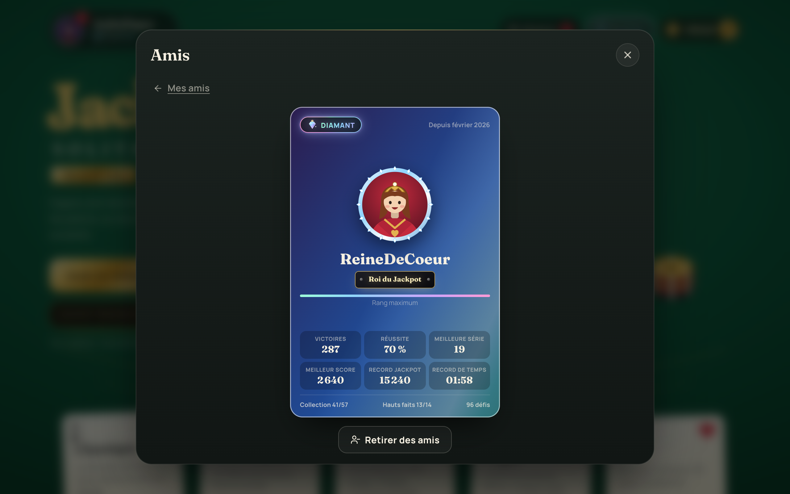
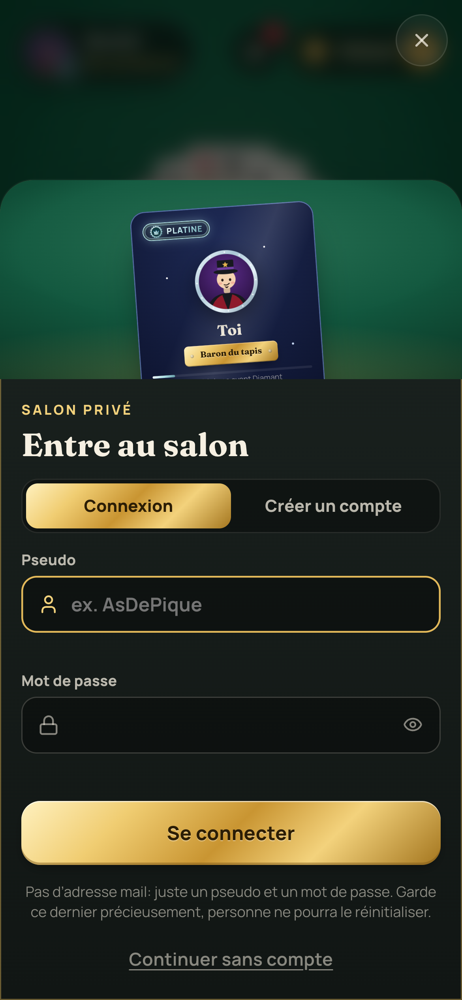
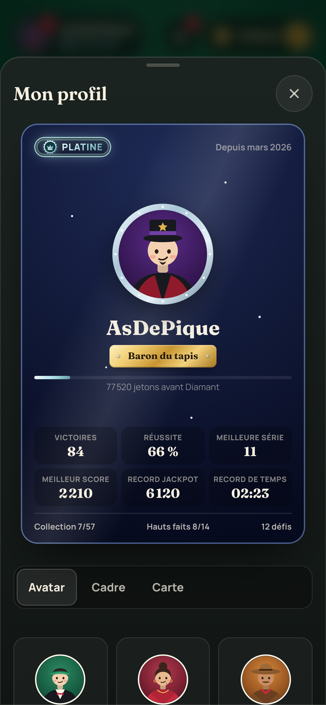

# Jackpot Solitaire

[](https://github.com/ClemLy/Jackpot-Solitaire/actions/workflows/ci.yml)

**[Jouer en ligne](https://clemly.github.io/Jackpot-Solitaire/)** · sur ordinateur, tablette ou téléphone, installable et jouable hors ligne.

Un Solitaire (Klondike) servi sur une table de casino : feutrine, jetons,
cartes ivoire illustrées. Chaque victoire rapporte des jetons, et le mode
Jackpot pose la seule question qui compte : encaisser, ou tout remettre en
jeu sur la manche suivante ?


## Sommaire

- [Aperçu](#aperçu)
- [Ce qui rend le jeu agréable](#ce-qui-rend-le-jeu-agréable)
- [Les modes de jeu](#les-modes-de-jeu)
- [Score et mode Jackpot](#score-et-mode-jackpot)
- [La banque, la boutique et les rangs VIP](#la-banque-la-boutique-et-les-rangs-vip)
- [Comptes, profil et amis](#comptes-profil-et-amis)
- [Sur téléphone](#sur-téléphone)
- [Direction artistique](#direction-artistique)
- [Lancer le projet](#lancer-le-projet)
- [Architecture du code](#architecture-du-code)
- [Tests](#tests)
- [Sécurité et robustesse](#sécurité-et-robustesse)
- [Intégration et déploiement continus](#intégration-et-déploiement-continus)
- [Mettre en ligne les comptes (Supabase)](#mettre-en-ligne-les-comptes-supabase)
- [Régénérer les captures et les icônes](#régénérer-les-captures-et-les-icônes)
- [Vie privée](#vie-privée)
- [Licence](#licence)

## Aperçu

| Partie en cours | Bordereau de gains |
| --- | --- |
|  |  |

| Boutique | Tables à mise |
| --- | --- |
|  |  |

| Roue du jour | Statistiques |
| --- | --- |
|  |  |

Les comptes, le profil et les amis :

| Connexion | Mon profil |
| --- | --- |
|  |  |

| Amis | Carte d’un ami |
| --- | --- |
|  |  |

Sur téléphone, en portrait et en paysage :

| Accueil | Partie | Victoire |
| --- | --- | --- |
|  |  |  |

| Connexion | Profil |
| --- | --- |
|  |  |


## Ce qui rend le jeu agréable

Au toucher et à la souris :

- Les cartes volent vraiment d’une pile à l’autre, même après un glisser :
  elles repartent de là où on les a lâchées.
- À chaque donne, les 28 cartes partent de la pioche une à une et se
  retournent en arrivant.
- Pendant un glisser, la pile penche dans le sens du geste et la
  destination valide s’illumine.
- Un simple clic, ou une tape, envoie une carte vers la meilleure
  destination : les fondations d’abord, sinon la colonne qui dévoile une
  carte cachée.
- Un coup impossible fait trembler la carte, qui revient à sa place.
- Éclat doré quand une carte rejoint une fondation, petit bouquet quand une
  enseigne est complète.
- Les colonnes trop longues se resserrent toutes seules : on tasse d’abord
  les cartes cachées, puis les visibles, sans jamais sortir de l’écran.
- La fin de manche se compte ligne par ligne sur un bordereau, tampons de
  multiplicateur compris.
- Sons synthétisés à la volée, sans aucun fichier audio : jetons qui
  s’entrechoquent, cliquet de roue, coup de tampon.

Pour le confort :

- Indice quand on bloque, qui montre aussi la pioche si c’est elle
  qu’il faut utiliser.
- Annuler illimité.
- Fin automatique dès que toutes les cartes de la table sont retournées et
  qu’il n’y a plus de suspense (vérifiée par simulation, donc jamais
  proposée à tort).
- Détection de blocage : si la donne ne peut plus jamais être terminée, le
  jeu le dit au lieu de laisser chercher dans le vide.
- Quatre niveaux de difficulté, qui pondèrent les jetons gagnés :

  | Niveau | Pioche | Donne | Gains |
  | --- | --- | --- | --- |
  | Facile | 1 | adoucie | ×0,5 |
  | Normal | 1 | au hasard | ×1 |
  | Difficile | 3 | adoucie | ×1,5 |
  | Expert | 3 | au hasard | ×3 |

  Une donne adoucie remonte les cartes basses vers le haut des colonnes :
  les As sont moins souvent enterrés sous les cartes cachées.
- Donnes garanties gagnables (option) : un solveur vérifie chaque donne
  dans un Web Worker avant de la servir, et prépare la suivante à l’avance.
  Plus confortable, donc gains ×0,75. Le défi du jour n’est pas concerné.
- Trois jokers à utiliser en pleine partie : Coup d’œil (regarder une carte
  cachée), Remélange (rebattre la pioche), Joker (poser une carte sur
  n’importe quelle colonne).
- Un tutoriel guidé sur une vraie donne, proposé à la première visite et
  rejouable depuis les règles.
- Vibrations sur les téléphones qui le permettent, aux moments clés.
- Graine de partie : rejouer une donne précise, ou l’envoyer par un lien
  `?seed=...`.

La progression reste sur l’appareil : statistiques, séries, meilleur temps,
quatorze hauts faits, calendrier des défis du mois.

## Les modes de jeu

Toutes les règles sont aussi expliquées dans le jeu (bouton Règles).

- **Jackpot** : le mode phare. On choisit sa table, on accumule un magot et
  on décide à chaque victoire d’encaisser ou de doubler.
- **Classique** : le Klondike tranquille, avec score, indices et annuler.
- **Défi du jour** : la même donne pour tout le monde ce jour-là, avec une
  prime à la première victoire.
- **Chrono** : cinq minutes pour tout ranger, à partir du premier coup.
  Chaque seconde restante rapporte 6 points ; à zéro, la partie est perdue.
- **Vegas** : la donne coûte 52 jetons, chaque carte rangée en rapporte de
  3 (Facile) à 15 (Expert). Un passage dans la pioche en pioche 1, trois en
  pioche 3, et pas d’annulation. Quitter paie les cartes déjà rangées.
- **Zen** : ni score, ni chrono, ni pénalité.

## Score et mode Jackpot

| Événement | Effet |
| --- | --- |
| Carte posée sur une fondation | +10 |
| Carte cachée révélée | +5 |
| Annuler un coup | -15 |
| Coup impossible | -5 |
| Indice | -25 |
| Recharger la pioche en Pioche 3 | -20 |
| Bonus de vitesse (fin de partie) | max(0, 1000 - secondes × 2) |
| Bonus sans faute (aucun coup invalide, aucun annuler) | +100 |

En mode Jackpot, chaque manche gagnée grossit le magot, multipliée par la
série en cours (×1, ×1,5, ×2, ×3, puis ×5), par la table et par la
difficulté. Après chaque victoire :

- **Encaisser** : le magot rejoint la banque, définitivement.
- **Quitte ou double** : on rejoue aussitôt en risquant tout. Une manche
  perdue ou abandonnée, et le magot retombe à zéro.
- **Mettre la moitié à l’abri** : la moitié part à la banque, l’autre reste
  en jeu et la série continue.

Avant son premier coup, chaque manche accepte des **paris annexes** : sans
indice (paie 1 pour 1), sans annuler (2 pour 1), en moins de trois minutes
(3 pour 1). Chaque pari coûte 10 % de la mise de la table, 50 jetons au
minimum.

Le **jackpot progressif** grossit à chaque manche distribuée et avec une
part des paris perdus. Il revient à qui gagne une manche en Expert, à une
table avec mise, sans annuler, sans indice ni joker, sur une donne non
garantie ; il repart ensuite de 5 000 jetons.

Trois victoires d’affilée ouvrent le coffre-fort : un multiplicateur
surprise sur tout le magot, souvent généreux, parfois piégé (×0,5).

Avant chaque série, on choisit sa table. La mise quitte la banque et entre
dans le magot : on la récupère en encaissant, on la perd avec la série.

| Table | Mise | Gains |
| --- | --- | --- |
| Libre | aucune | ×1 |
| Argent | 500 | ×1,5 |
| Or | 2 500 | ×2 |
| Diamant (rang VIP Or) | 10 000 | ×3 |
| Salon Platine (rang VIP Platine) | 25 000 | ×4 |
| Légende (rang VIP Diamant) | 75 000 | ×6 |

## La banque, la boutique et les rangs VIP

D’où viennent les jetons :

- Encaisser un magot du mode Jackpot, de loin la source principale.
- Un pourboire de 10 % du score sur toute autre victoire.
- 500 jetons pour la première victoire du défi du jour.
- La roue du jour : un tour gratuit par jour, pour des jetons ou un bonus.
- 1 000 jetons de bienvenue. Les sauvegardes d’avant la boutique gardent
  leur banque, convertie en solde.

À quoi ils servent :

- **La boutique** : une quarantaine d’objets, tous visibles avant achat,
  même ceux encore verrouillés.
  - Treize dos de cartes, du treillis bordeaux au « Triple sept » doré.
  - Quatre recto de cartes : ivoire, parchemin, noir & or, or massif.
  - Douze tapis, dont un ciel étoilé qui scintille et une laque noire à la
    feuille d’or.
  - Sept effets de victoire, du champagne à la supernova.
  - Six titres honorifiques, affichés sur l’accueil et sur chaque
    bordereau, de « Flambeur » à « Roi du Jackpot ».
  - Pour le profil : seize avatars (quatre offerts), douze cadres (quatre
    se gagnent avec le rang, sept s’achètent) et neuf cartes de profil,
    de l’enseigne de Vegas à la carte holographique.
  - Les pièces maîtresses (badge Graal) coûtent de 160 000 à 1 000 000 de
    jetons et sont réservées au rang Diamant.
- **Les tables à mise**, pour faire fructifier sa banque.
- **Six bonus** :
  - Coup d’œil, Remélange et Joker : les jokers décrits plus haut.
  - Œil du croupier : un indice offert, sans pénalité.
  - Assurance : activée avant un quitte ou double, elle rend la moitié du
    magot si la manche est perdue ou abandonnée.
  - Seconde chance : sur une donne bloquée en Jackpot, redistribue une
    manche neuve sans perdre le magot.

**Les missions** : trois par jour et trois par semaine, tirées de la date
(les mêmes pour tout le monde), de 100 à 2 500 jetons chacune. On récupère
la récompense à la main, avant le renouvellement.

Le rang VIP dépend du total de jetons gagnés depuis le début ; les achats ne
le font jamais baisser. Dès le rang Argent, un **coffret hebdomadaire**
offre des bonus, cumulés d’un rang à l’autre : Œil du croupier (Argent),
Assurance (Or), Joker et missions +25 % (Platine), Seconde chance et
missions +50 % (Diamant).

Chaque rang a sa couleur et son emblème, de plus en plus travaillé : une
médaille de bronze toute simple, une médaille d’argent polie à double
anneau, une pièce d’or perlée à couronne sertie de rubis et traversée d’un
reflet, un insigne de platine étoilé ceint de lauriers, puis un diamant à
facettes prismatiques, rayons tournants et étincelles. Le nom du rang suit
la même progression (uni, métallisé, brillant, reflet animé, prisme
animé), tout comme le contour de ses pastilles. On le retrouve sur
l’accueil, la plaque et la carte de profil, la liste d’amis et la boutique.
Chaque rang débloque aussi son cadre de portrait (cercle d’argent, d’or, de
platine, couronne de diamants).

| Rang | Dès | Remise | Roue du jour | Ce qu’il ouvre |
| --- | --- | --- | --- | --- |
| Bronze | 0 | aucune | ×1 | La boutique de base |
| Argent | 5 000 | 5 % | ×1,25 | Holographique, marbre, parchemin, Flambeur |
| Or | 20 000 | 10 % | ×1,5 | Table Diamant, salon doré, blason, champagne |
| Platine | 60 000 | 15 % | ×2 | Salon Platine, noir & or, obsidienne, Las Vegas |
| Diamant | 150 000 | 20 % | ×3 | Table Légende et toutes les pièces maîtresses |

Un compteur de collection suit les objets possédés, et deux hauts faits
récompensent le premier Graal et la collection complète.

## Sur téléphone

Le jeu est pensé pour le pouce autant que pour la souris.

- En portrait, les actions (indice, annuler, nouvelle donne, options) sont
  dans un dock en bas d’écran, et les fenêtres montent du bas comme des
  feuilles.
- En paysage, le dock passe sur le côté pour laisser toute la hauteur aux
  cartes.
- Les cartes prennent toute la largeur disponible ; leurs coins restent
  lisibles même quand les colonnes se resserrent.
- Zones tactiles d’au moins 44 pixels, encoches et bords arrondis pris en
  compte, pas de menu contextuel sur un appui long.
- Vérifié de 320 pixels de large (iPhone SE) jusqu’au grand écran, en
  portrait comme en paysage.

Pour l’installer : depuis le navigateur du téléphone, « Ajouter à
l’écran d’accueil ». Il se lance alors en plein écran et fonctionne sans
connexion.

## Direction artistique

Une table de casino, pas une interface web.

- Feutrine éclairée par un spot, avec un grain discret et des bords qui
  s’assombrissent. Neuf tapis au choix.
- Le titre est doré à chaud sur le tapis, et une ligne courbe y est
  imprimée comme sur les tables de blackjack.
- Les modes de jeu sont de vraies cartes posées de travers sur la table.
  Elles sont distribuées face cachée puis se retournent, respirent au repos,
  s’inclinent sous le curseur et s’envolent en se retournant quand on en
  choisit une. Chacune a son petit emblème animé : trotteuse du chrono, cœur
  qui bat pour le zen, carreau qui scintille pour le défi du jour.
- La fin de manche s’imprime sur un bordereau papier, avec des tampons
  encreurs pour les multiplicateurs.
- Cartes ivoire aux index serif, enseignes vectorielles (les glyphes Unicode
  deviennent des emojis sur certains téléphones).
- Valet, Dame et Roi illustrés aux couleurs de leur enseigne. Ils gardent
  leur caractère : grognons sur un coup interdit, clin d’œil quand un
  indice les montre.
- Typographie : Fraunces pour les titres et les chiffres, Manrope pour
  l’interface, embarquées pour fonctionner hors ligne.

## Comptes, profil et amis

Le compte est **facultatif** : on peut toujours jouer en invité, la
progression reste alors dans le navigateur. Un compte sert à ne plus la
perdre (cache vidé, autre ordinateur, téléphone).

- **Juste un pseudo et un mot de passe**, sans adresse mail. Pseudo de 3 à
  16 caractères (lettres, chiffres, `-` et `_`), unique sans tenir compte
  des majuscules. Mot de passe de 10 caractères au moins, lettres et
  chiffres. Sans mail, un mot de passe oublié ne se réinitialise pas.
- **La progression d’invité est reprise** à l’inscription : banque,
  collection, statistiques, hauts faits. La sauvegarde d’invité reste sur
  l’appareil et revient à la déconnexion.
- **Le profil** : un avatar façon figure de carte, un cadre et une carte de
  profil qui résume la progression (rang, victoires, réussite, records,
  collection, hauts faits). Tout se choisit dans « Profil » ; ce qui manque
  s’achète en boutique ou se débloque avec le rang.
- **La plaque de profil**, en haut à gauche de l’accueil : portrait
  encadré, pseudo et rang. En invité, elle propose de se connecter ; une
  pastille signale les demandes d’amis reçues.
- **Les amis** : on ajoute un joueur par son pseudo, il accepte ou refuse.
  Entre amis, chacun voit la carte de l’autre. Pas de multijoueur : c’est
  pour suivre la progression des autres. Un joueur qui n’est pas ami ne
  voit que sa vignette (pseudo, avatar, rang).
- **Changer de mot de passe** et **supprimer son compte** (définitif, avec
  confirmation) se font depuis le profil.

## Lancer le projet

Prérequis : Node 20 ou plus récent.

```bash
npm install     # une seule fois
npm run dev     # http://localhost:5173
```

Pour tester la version de production (PWA, hors ligne) :

```bash
npm run build && npm run preview
```

| Script | Rôle |
| --- | --- |
| `npm run dev` | Serveur de développement avec rechargement à chaud. |
| `npm run build` | Vérifie les types puis produit le build dans `dist/`. |
| `npm run preview` | Sert le build de production en local. |
| `npm test` | Tests unitaires et d’interface (Vitest, Testing Library). |
| `npm run test:e2e` | Tests de bout en bout sur le build de production (Playwright). |
| `npm run test:watch` | Tests en mode surveillance. |
| `npm run typecheck` | Vérification stricte des types TypeScript. |
| `npm run lint` | Analyse statique ESLint. |
| `npm run format` | Reformate le code avec Prettier. |
| `npm run format:check` | Vérifie le formatage sans modifier. |
| `npm run screenshots` | Régénère les captures et les icônes. |
| `npm run api:build` | Empaquette la fonction serveur `api` (moteur et économie partagés). |
| `npm run api:deploy` | Empaquette puis déploie la fonction `api` sur Supabase. |

Avant de pousser, `npm run format:check && npm run lint && npm run typecheck && npm test && npm run test:e2e`
reproduit la CI.

Sans configuration, le jeu tourne en invité seul. Pour développer les
comptes en local (Docker requis) :

```bash
npx supabase start                    # base, authentification, passerelle
npm run api:build                     # empaquette la fonction api
npx supabase functions serve api      # dans un second terminal
cp .env.example .env.local            # puis y coller l'URL et la cle
npm run dev                           # publiable affichees par supabase start
```

`supabase/functions/.env` liste les origines autorisées en local
(`ALLOWED_ORIGINS`).

## Architecture du code

Trois couches nettes, pour que la logique de jeu reste testable sans
l’interface.

```
src/
  engine/      Moteur pur, sans dépendance UI (déterministe, testé)
    types.ts     Modèle de données immuable (Board, Card, Move)
    rng.ts       Générateur pseudo-aléatoire déterministe (graines)
    deck.ts      Création et distribution du jeu
    rules.ts     Validation des placements et des séquences
    moves.ts     Coups, déplacement automatique, indices, fin automatique,
                 détection de blocage
    scoring.ts   Score et bonus de fin de partie
    solver.ts    Solveur : prouve qu'une donne se gagne (donnes garanties)
    dealer.ts    Recherche d'une donne gagnable
  core/        Cœur partagé navigateur / serveur, pur et déterministe
    rounds.ts    Manches : début, rejeu du journal de coups, victoire,
                 défaite, encaisser ou doubler, coffre-fort
    shop.ts      Achats, roue, missions, coffret de rang, objets équipés
    actions.ts   Les actions qu'un joueur peut demander, validées
    sanitize.ts  Validation d'un état de joueur, import d'une sauvegarde
                 d'invité (plafonnée)
    profile.ts   Carte de profil publique et vignette
    calendar.ts  Jour et semaine de jeu (fuseau Europe/Paris)
  state/       État applicatif (Zustand)
    game.ts      Partie en cours : coups, annuler, chrono, Jackpot, mises,
                 assurance, navigation
    meta.ts      Données persistantes : réglages, stats, portefeuille,
                 inventaire, roue, hauts faits, migration des sauvegardes
    catalog.ts   Économie pure : boutique, bonus, rangs VIP, tables, roue
    gambling.ts  Règles chiffrées du mode Jackpot
    persistence.ts  Stockage local qui ne plante jamais, validation de la
                    sauvegarde champ par champ
    missions.ts  Missions quotidiennes et hebdomadaires
    dealer.ts    Donnes garanties préparées dans un Web Worker
    account.ts   Session, inscription, connexion, amis (client Supabase)
    economy.ts   Envoie chaque action d'argent au cœur local (invité) ou
                 au serveur (compte)
    achievements.ts
  audio/
    sfx.ts       Sons synthétisés à la volée (Web Audio API)
    haptics.ts   Vibrations (Vibration API)
  components/  Interface React (plateau, bandeau, dock, boutique, roue,
               missions, jokers, paris, tutoriel, écrans 404 et plantage,
               connexion, profil, amis)
    Portrait.tsx    Avatar dans son cadre (SVG, cadres animés)
    ProfileCard.tsx Carte de profil et ligne d'ami
    Rank.tsx        Emblèmes et étiquettes des rangs VIP
  styles/      Tokens et tapis, cartes, plateau, interface, comptes, rangs
  utils/       Formatage, graines, adresses, erreurs, tracés des enseignes
server/        Fonction api : authentifie, rejoue et enregistre
supabase/      Configuration, migration SQL (tables, verrous, quotas),
               point d'entrée de la fonction
e2e/           Tests de bout en bout (Playwright)
404.html       Page servie par GitHub Pages pour toute adresse inconnue
```

Choix techniques notables :

- **Moteur immuable** : chaque coup renvoie un nouveau plateau. L’historique
  d’annulation n’est qu’une pile d’états, et les tests restent simples.
- **Graines déterministes** : un hash de chaîne alimente un générateur
  mulberry32. Deux graines identiques donnent la même partie, d’où le défi
  du jour et le partage par lien.
- **Fin automatique sûre** : lancée seulement quand plus aucune carte de la
  table n’est face cachée et que la partie peut vraiment se terminer en
  envoyant les cartes aux fondations, vérifié par simulation.
- **Détection de blocage** : la partie n’est déclarée perdue que si aucun
  coup ne peut plus jamais faire progresser la donne, en simulant tous les
  tirages accessibles via la pioche.
- **Animations FLIP** via la Web Animations API, mesurées sur la position de
  mise en page plutôt que sur la position affichée : plusieurs cartes
  peuvent voler en même temps sans se fausser.
- **Colonnes adaptatives** : les écarts de chaque colonne sont calculés à
  partir de la hauteur réellement disponible.

Pile technique : React 18, TypeScript, Vite 8, Zustand, vite-plugin-pwa,
Vitest, Testing Library, Playwright, Lucide, Fontsource (Fraunces, Manrope).

## Tests

```bash
npm test                              # unitaires et interface
npx playwright install chromium       # une seule fois
npm run test:e2e                      # bout en bout
```

Quatre étages :

- **Moteur** : mélange déterministe, distribution pour chaque difficulté,
  règles de placement, coups illégaux ou aux index absurdes, victoire et
  blocage, fin automatique, indices, score. Des **parties aléatoires**
  (`fuzz.test.ts`) jouent des milliers de coups au hasard et vérifient après
  chacun que les 52 cartes sont toutes là, que les fondations et colonnes
  restent valides et que le plateau d’origine n’est jamais modifié. Le
  solveur est vérifié en rejouant chacune de ses solutions jusqu’à la
  victoire ; pioche limitée, joker et remélange ont leurs propres tests.
- **Économie et parcours de jeu** : pourboires par difficulté, gains du
  Jackpot (série, table, difficulté), quitte ou double, coffre-fort,
  défaite, assurance, seconde chance, annuler, indices, et les garde-fous
  (pas d’encaissement en pleine partie, pas de double encaissement, une
  seule ouverture de coffre). Vegas, Chrono, moitié à l’abri, paris annexes,
  jackpot progressif et ses conditions, jokers, missions, coffret de rang,
  donnes garanties et tutoriel ont chacun leur parcours complet.
- **Cœur partagé et serveur** : chaque gain est recalculé en rejouant le
  journal de coups ; un journal truqué (coup impossible, pari posé après
  le premier coup, victoire inventée, chrono dépassé) est refusé. Les
  tests d’intégration de la fonction `api` tournent contre un Supabase
  local (`supabase start`) et sont sautés s’il n’est pas lancé : verrous
  de la base, pseudos réservés, import plafonné, amis, conflits de version.
- **Sauvegarde** : stockage plein ou bloqué, JSON corrompu mis de côté,
  sauvegarde bricolée (soldes négatifs, objets inconnus, types faux).
- **Interface** : écran de plantage, page 404, notifications d’erreur,
  réglages, pioche au clavier, confirmation avant de fermer l’onglet,
  missions, paris, jokers, compte à rebours, tutoriel.

Les tests de bout en bout tournent sur le build de production servi sous
`/Jackpot-Solitaire/`, sur ordinateur et téléphone : ils échouent à la
moindre erreur console ou violation de la CSP. La suite des comptes
(`e2e/accounts.spec.ts` : inscription avec reprise de la progression,
reconnexion, mauvais mot de passe, amis) ne tourne que si
`VITE_SUPABASE_URL` est défini, avec le Supabase local lancé.

## Sécurité et robustesse

En invité, tout se passe dans le navigateur. Avec un compte, le serveur
fait autorité. Ce qui est en place :

- **Le serveur rejoue chaque partie** : le navigateur n’envoie jamais un
  gain, seulement le journal de ses coups. La fonction `api` rejoue ce
  journal depuis la graine, avec le même cœur que le jeu, et ne paie que
  ce qu’elle a vérifié. La donne, l’heure, le jour et le hasard (roue,
  coffre-fort) viennent du serveur.
- **Base verrouillée** : sécurité au niveau des lignes activée sans aucune
  règle d’accès, droits retirés aux rôles publics. Le navigateur ne peut
  ni lire ni écrire une table ; tout passe par la fonction, avec la clé de
  service qui ne quitte jamais Supabase.
- **Authentification Supabase** : mots de passe hachés (bcrypt), sessions
  à jeton signé, 10 caractères minimum avec lettres et chiffres. Le pseudo
  devient une adresse interne (`pseudo@joueurs.jackpot-solitaire.invalid`,
  domaine réservé qui ne reçoit jamais de mail). Un déclencheur SQL refuse
  les pseudos invalides, réservés (admin, croupier…) ou incohérents.
- **Garde-fous de la fonction** : origines autorisées (CORS), 120
  requêtes par minute et par compte, corps de 512 Ko au plus, écritures
  concurrentes détectées (version), import d’invité plafonné, 200 amis et
  50 demandes en attente au plus. Les erreurs ne divulguent rien.

- **Politique de sécurité du contenu** (CSP) injectée dans le HTML de
  production : scripts, styles et polices ne viennent que du site, aucun
  `unsafe-inline` ni `unsafe-eval`, pas d’`<object>`, pas de formulaire.
- **Aucun HTML injecté** : tout texte affiché passe par React, y compris la
  graine lue dans l’adresse et le chemin affiché sur la page 404.
- **Graines nettoyées** : caractères de contrôle retirés, longueur bornée.
- **Sauvegarde validée** au chargement, champ par champ : une sauvegarde
  modifiée à la main ne peut ni planter le jeu ni produire un solde négatif
  ou infini. Une sauvegarde illisible est mise de côté (clé
  `jackpot-solitaire-meta-v1-illisible`) et le joueur est prévenu.
- **Actions d’argent protégées** : encaisser, doubler, miser, ouvrir le
  coffre ne fonctionnent que dans l’état de jeu prévu.
- **Erreurs visibles** : un plantage de l’interface affiche un écran dédié
  (retour à l’accueil, rapport à copier) ; les autres erreurs donnent une
  notification discrète sans interrompre la partie.
- **Dépendances** : `npm audit` à zéro vulnérabilité ; l’outil de
  développement exposé sur `window` n’existe qu’en mode dev.

Limites connues : en invité, les jetons et la roue du jour reposent sur
le navigateur et l’horloge de l’appareil, donc un joueur déterminé peut
tricher sur sa propre sauvegarde. Il ne l’emporte pas dans un compte :
l’import d’invité est plafonné (jetons, records, collection). Le serveur
vérifie qu’une partie est jouable et gagnée, pas qu’un humain l’a jouée :
un programme qui résout les donnes reste possible, comme dans tout
solitaire. GitHub Pages ne permet pas d’en-têtes HTTP : pas de
`frame-ancestors` ni de HSTS au-delà de ce que GitHub fournit.

## Intégration et déploiement continus

Le workflow GitHub Actions (`.github/workflows/ci.yml`) tourne à chaque push
et pull request sur `main` :

1. Formatage (Prettier)
2. Analyse statique (ESLint)
3. Types (TypeScript)
4. Tests unitaires et d’interface (Vitest)
5. Build de production (Vite)
6. En parallèle : tests de bout en bout (Playwright), traces jointes en
   cas d’échec

Sur un push vers `main`, et seulement si tout est vert, le jeu est construit
pour le sous-chemin du dépôt puis publié sur
[GitHub Pages](https://clemly.github.io/Jackpot-Solitaire/).

Pour activer le déploiement sur un fork : Settings, Pages, source « GitHub
Actions ».

## Mettre en ligne les comptes (Supabase)

À faire une fois. Sans cela, le site publié reste en invité seul.

1. Créer un projet sur [supabase.com](https://supabase.com) (l’offre
   gratuite suffit), région Europe de préférence.
2. Dans *Authentication > Sign In / Providers > Email* : désactiver
   « Confirm email ». Dans les réglages des mots de passe : longueur
   minimale 10, lettres et chiffres exigés.
3. Relier le dépôt et appliquer la migration :

   ```bash
   npx supabase login
   npx supabase link --project-ref <id-du-projet>
   npx supabase db push
   ```

4. Autoriser le site publié, puis déployer la fonction :

   ```bash
   npx supabase secrets set ALLOWED_ORIGINS=https://clemly.github.io
   npm run api:deploy
   ```

5. Dans GitHub, *Settings > Secrets and variables > Actions > Variables* :
   ajouter `SUPABASE_URL` (`https://<id-du-projet>.supabase.co`) et
   `SUPABASE_PUBLISHABLE_KEY` (*Project Settings > API Keys*, clé
   publiable : elle est faite pour être publique, la base reste fermée).
6. Pousser sur `main` : le build publié active les comptes et sa CSP
   autorise l’adresse Supabase.

Après une modification de `src/core` ou de `server/`, redéployer avec
`npm run api:deploy` ; après une nouvelle migration, `npx supabase db push`.

## Régénérer les captures et les icônes

Les captures (`screenshots/`) et les icônes PWA (`public/`) sont produites à
partir du vrai rendu du jeu, piloté par Playwright : une partie réellement
jouée coup par coup, sur ordinateur, téléphone en portrait et en paysage.
Les écrans de compte (connexion, profil, amis) utilisent une adresse
Supabase factice : les appels au serveur sont interceptés et reçoivent des
amis de démonstration, aucun Supabase n’est nécessaire.

```bash
npx playwright install chromium   # une seule fois
npm run screenshots

PW_CHANNEL=chrome npm run screenshots   # ou avec le Chrome déjà installé
```

## Vie privée

Aucun pistage, aucune publicité, aucune adresse mail. En invité,
statistiques, réglages, banque, achats et hauts faits restent dans le
navigateur (localStorage). Avec un compte, le serveur garde le pseudo, le
mot de passe haché et l’état de jeu, rien d’autre ; les réglages de
l’appareil (son, vibrations, difficulté) restent locaux. Supprimer son
compte efface tout, amis compris. Les jetons n’ont aucune valeur réelle et ne
s’achètent pas : ils se gagnent en jouant.

## Licence

Distribué sous licence MIT. Voir le fichier [LICENSE](LICENSE).
