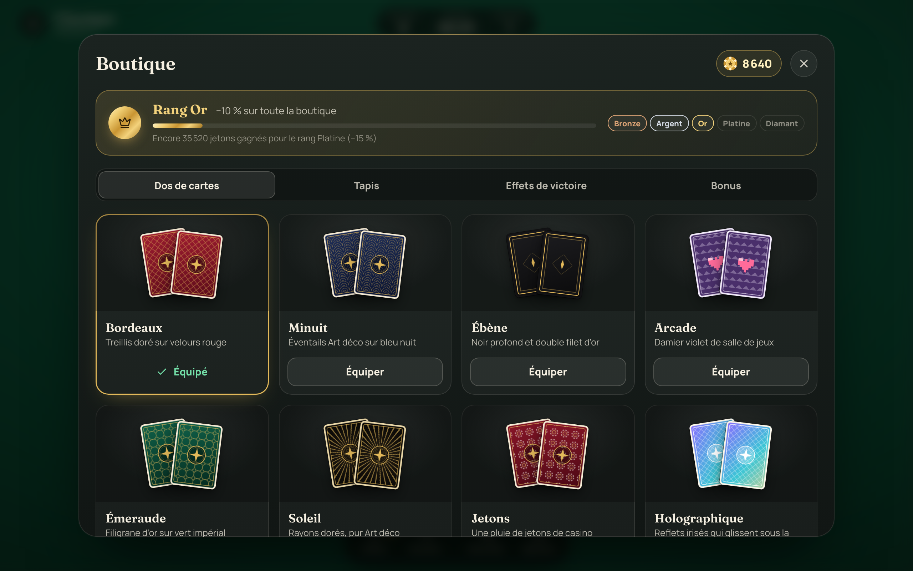
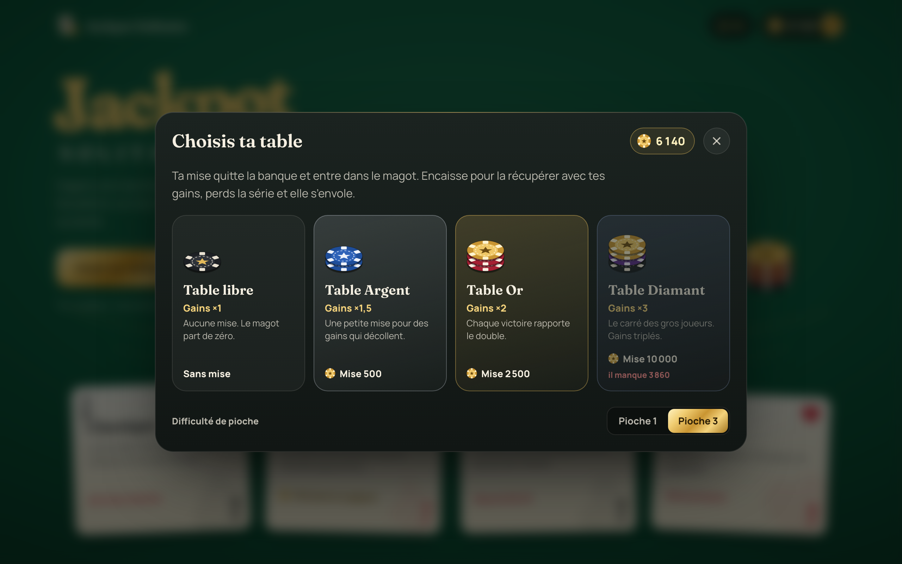
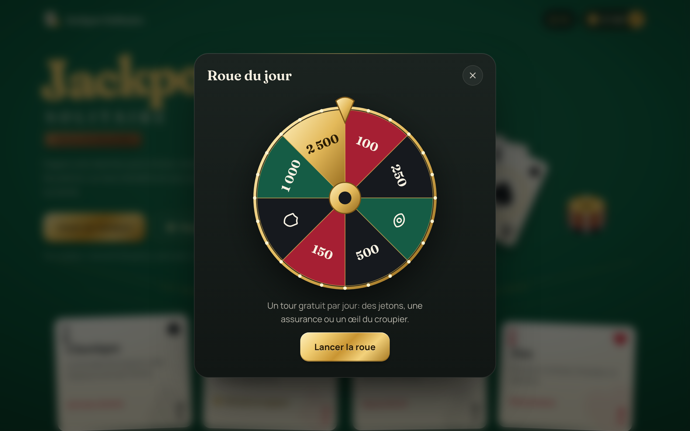
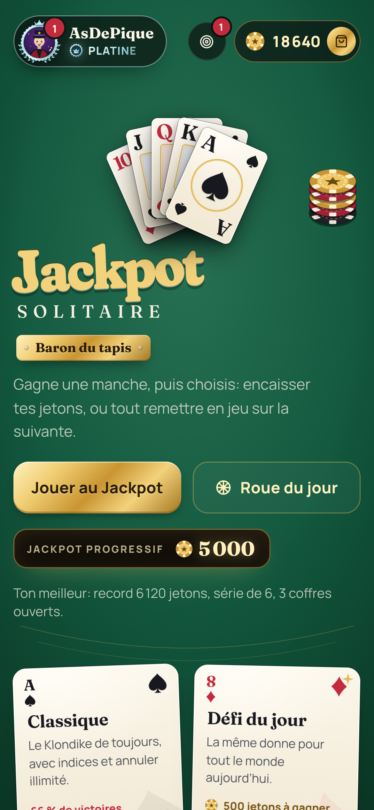
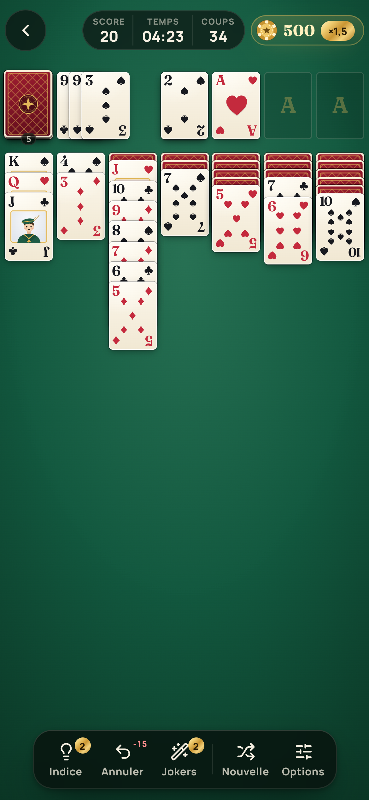
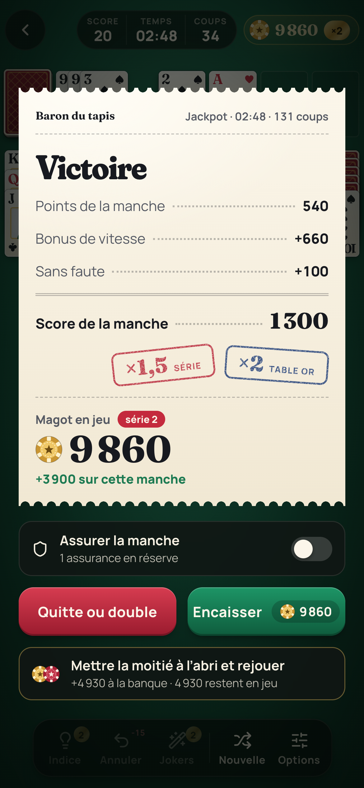
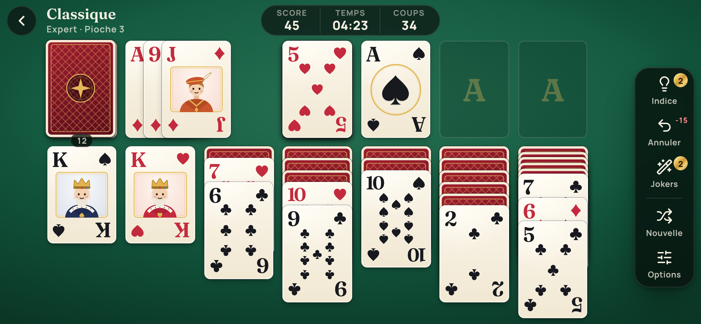

# Jackpot Solitaire

[](https://github.com/ClemLy/Jackpot-Solitaire/actions/workflows/ci.yml)

**[Jouer en ligne](https://clemly.github.io/Jackpot-Solitaire/)** · sur ordinateur, tablette ou téléphone, installable et jouable hors ligne.

Un Solitaire (Klondike) servi sur une table de casino : feutrine, jetons,
cartes ivoire illustrées. Chaque victoire rapporte des jetons, et le mode
Jackpot pose la seule question qui compte : encaisser, ou tout remettre en
jeu sur la manche suivante ?


## Sommaire

- [Aperçu](#aperçu)
- [Ce qui rend le jeu agréable](#ce-qui-rend-le-jeu-agréable)
- [Les modes de jeu](#les-modes-de-jeu)
- [Score et mode Jackpot](#score-et-mode-jackpot)
- [La banque, la boutique et les rangs VIP](#la-banque-la-boutique-et-les-rangs-vip)
- [Sur téléphone](#sur-téléphone)
- [Direction artistique](#direction-artistique)
- [Lancer le projet](#lancer-le-projet)
- [Architecture du code](#architecture-du-code)
- [Tests](#tests)
- [Intégration et déploiement continus](#intégration-et-déploiement-continus)
- [Régénérer les captures et les icônes](#régénérer-les-captures-et-les-icônes)
- [Vie privée](#vie-privée)
- [Licence](#licence)

## Aperçu

| Partie en cours | Bordereau de gains |
| --- | --- |
|  |  |

| Boutique | Tables à mise |
| --- | --- |
|  |  |

| Roue du jour | Statistiques |
| --- | --- |
|  |  |

Sur téléphone, en portrait et en paysage :

| Accueil | Partie | Victoire |
| --- | --- | --- |
|  |  |  |



## Ce qui rend le jeu agréable

Au toucher et à la souris :

- Les cartes volent vraiment d’une pile à l’autre, même après un glisser :
  elles repartent de là où on les a lâchées.
- À chaque donne, les 28 cartes partent de la pioche une à une et se
  retournent en arrivant.
- Pendant un glisser, la pile penche dans le sens du geste et la
  destination valide s’illumine.
- Un simple clic, ou une tape, envoie une carte vers la meilleure
  destination : les fondations d’abord, sinon la colonne qui dévoile une
  carte cachée.
- Un coup impossible fait trembler la carte, qui revient à sa place.
- Éclat doré quand une carte rejoint une fondation, petit bouquet quand une
  enseigne est complète.
- Les colonnes trop longues se resserrent toutes seules : on tasse d’abord
  les cartes cachées, puis les visibles, sans jamais sortir de l’écran.
- La fin de manche se compte ligne par ligne sur un bordereau, tampons de
  multiplicateur compris.
- Sons synthétisés à la volée, sans aucun fichier audio : jetons qui
  s’entrechoquent, cliquet de roue, coup de tampon.

Pour le confort :

- Indice quand on bloque, qui montre aussi la pioche si c’est elle
  qu’il faut utiliser.
- Annuler illimité.
- Fin automatique dès que toutes les cartes de la table sont retournées et
  qu’il n’y a plus de suspense (vérifiée par simulation, donc jamais
  proposée à tort).
- Détection de blocage : si la donne ne peut plus jamais être terminée, le
  jeu le dit au lieu de laisser chercher dans le vide.
- Quatre niveaux de difficulté, qui pondèrent les jetons gagnés :

  | Niveau | Pioche | Donne | Gains |
  | --- | --- | --- | --- |
  | Facile | 1 | adoucie | ×0,5 |
  | Normal | 1 | au hasard | ×1 |
  | Difficile | 3 | adoucie | ×1,5 |
  | Expert | 3 | au hasard | ×3 |

  Une donne adoucie remonte les cartes basses vers le haut des colonnes :
  les As sont moins souvent enterrés sous les cartes cachées.
- Graine de partie : rejouer une donne précise, ou l’envoyer par un lien
  `?seed=...`.

La progression reste sur l’appareil : statistiques, séries, meilleur temps,
quatorze hauts faits, calendrier des défis du mois.

## Les modes de jeu

Toutes les règles sont aussi expliquées dans le jeu (bouton Règles).

- **Jackpot** : le mode phare. On choisit sa table, on accumule un magot et
  on décide à chaque victoire d’encaisser ou de doubler.
- **Classique** : le Klondike tranquille, avec score, indices et annuler.
- **Défi du jour** : la même donne pour tout le monde ce jour-là, avec une
  prime à la première victoire.
- **Chrono** : mêmes règles, mais le bonus de vitesse fond à chaque seconde.
- **Zen** : ni score, ni chrono, ni pénalité.

## Score et mode Jackpot

| Événement | Effet |
| --- | --- |
| Carte posée sur une fondation | +10 |
| Carte cachée révélée | +5 |
| Annuler un coup | -15 |
| Coup impossible | -5 |
| Indice | -25 |
| Recharger la pioche en Pioche 3 | -20 |
| Bonus de vitesse (fin de partie) | max(0, 1000 - secondes × 2) |
| Bonus sans faute (aucun coup invalide, aucun annuler) | +100 |

En mode Jackpot, chaque manche gagnée grossit le magot, multipliée par la
série en cours (×1, ×1,5, ×2, ×3, puis ×5), par la table et par la
difficulté. Après chaque victoire :

- **Encaisser** : le magot rejoint la banque, définitivement.
- **Quitte ou double** : on rejoue aussitôt en risquant tout. Une manche
  perdue ou abandonnée, et le magot retombe à zéro.

Trois victoires d’affilée ouvrent le coffre-fort : un multiplicateur
surprise sur tout le magot, souvent généreux, parfois piégé (×0,5).

Avant chaque série, on choisit sa table. La mise quitte la banque et entre
dans le magot : on la récupère en encaissant, on la perd avec la série.

| Table | Mise | Gains |
| --- | --- | --- |
| Libre | aucune | ×1 |
| Argent | 500 | ×1,5 |
| Or | 2 500 | ×2 |
| Diamant (rang VIP Or) | 10 000 | ×3 |
| Salon Platine (rang VIP Platine) | 25 000 | ×4 |
| Légende (rang VIP Diamant) | 75 000 | ×6 |

## La banque, la boutique et les rangs VIP

D’où viennent les jetons :

- Encaisser un magot du mode Jackpot, de loin la source principale.
- Un pourboire de 10 % du score sur toute autre victoire.
- 500 jetons pour la première victoire du défi du jour.
- La roue du jour : un tour gratuit par jour, pour des jetons ou un bonus.
- 1 000 jetons de bienvenue. Les sauvegardes d’avant la boutique gardent
  leur banque, convertie en solde.

À quoi ils servent :

- **La boutique** : une quarantaine d’objets, tous visibles avant achat,
  même ceux encore verrouillés.
  - Treize dos de cartes, du treillis bordeaux au « Triple sept » doré.
  - Quatre recto de cartes : ivoire, parchemin, noir & or, or massif.
  - Douze tapis, dont un ciel étoilé qui scintille et une laque noire à la
    feuille d’or.
  - Sept effets de victoire, du champagne à la supernova.
  - Six titres honorifiques, affichés sur l’accueil et sur chaque
    bordereau, de « Flambeur » à « Roi du Jackpot ».
  - Les pièces maîtresses (badge Graal) coûtent de 160 000 à 1 000 000 de
    jetons et sont réservées au rang Diamant.
- **Les tables à mise**, pour faire fructifier sa banque.
- **Trois bonus** :
  - Œil du croupier : un indice offert, sans pénalité.
  - Assurance : activée avant un quitte ou double, elle rend la moitié du
    magot si la manche est perdue ou abandonnée.
  - Seconde chance : sur une donne bloquée en Jackpot, redistribue une
    manche neuve sans perdre le magot.

Le rang VIP dépend du total de jetons gagnés depuis le début ; les achats ne
le font jamais baisser.

| Rang | Dès | Remise | Roue du jour | Ce qu’il ouvre |
| --- | --- | --- | --- | --- |
| Bronze | 0 | aucune | ×1 | La boutique de base |
| Argent | 5 000 | 5 % | ×1,25 | Holographique, marbre, parchemin, Flambeur |
| Or | 20 000 | 10 % | ×1,5 | Table Diamant, salon doré, blason, champagne |
| Platine | 60 000 | 15 % | ×2 | Salon Platine, noir & or, obsidienne, Las Vegas |
| Diamant | 150 000 | 20 % | ×3 | Table Légende et toutes les pièces maîtresses |

Un compteur de collection suit les objets possédés, et deux hauts faits
récompensent le premier Graal et la collection complète.

## Sur téléphone

Le jeu est pensé pour le pouce autant que pour la souris.

- En portrait, les actions (indice, annuler, nouvelle donne, options) sont
  dans un dock en bas d’écran, et les fenêtres montent du bas comme des
  feuilles.
- En paysage, le dock passe sur le côté pour laisser toute la hauteur aux
  cartes.
- Les cartes prennent toute la largeur disponible ; leurs coins restent
  lisibles même quand les colonnes se resserrent.
- Zones tactiles d’au moins 44 pixels, encoches et bords arrondis pris en
  compte, pas de menu contextuel sur un appui long.
- Vérifié de 320 pixels de large (iPhone SE) jusqu’au grand écran, en
  portrait comme en paysage.

Pour l’installer : depuis le navigateur du téléphone, « Ajouter à
l’écran d’accueil ». Il se lance alors en plein écran et fonctionne sans
connexion.

## Direction artistique

Une table de casino, pas une interface web.

- Feutrine éclairée par un spot, avec un grain discret et des bords qui
  s’assombrissent. Neuf tapis au choix.
- Le titre est doré à chaud sur le tapis, et une ligne courbe y est
  imprimée comme sur les tables de blackjack.
- Les modes de jeu sont de vraies cartes posées de travers sur la table.
  Elles sont distribuées face cachée puis se retournent, respirent au repos,
  s’inclinent sous le curseur et s’envolent en se retournant quand on en
  choisit une. Chacune a son petit emblème animé : trotteuse du chrono, cœur
  qui bat pour le zen, carreau qui scintille pour le défi du jour.
- La fin de manche s’imprime sur un bordereau papier, avec des tampons
  encreurs pour les multiplicateurs.
- Cartes ivoire aux index serif, enseignes vectorielles (les glyphes Unicode
  deviennent des emojis sur certains téléphones).
- Valet, Dame et Roi illustrés aux couleurs de leur enseigne. Ils gardent
  leur caractère : grognons sur un coup interdit, clin d’œil quand un
  indice les montre.
- Typographie : Fraunces pour les titres et les chiffres, Manrope pour
  l’interface, embarquées pour fonctionner hors ligne.

## Lancer le projet

Prérequis : Node 20 ou plus récent.

```bash
npm install     # une seule fois
npm run dev     # http://localhost:5173
```

Pour tester la version de production (PWA, hors ligne) :

```bash
npm run build && npm run preview
```

| Script | Rôle |
| --- | --- |
| `npm run dev` | Serveur de développement avec rechargement à chaud. |
| `npm run build` | Vérifie les types puis produit le build dans `dist/`. |
| `npm run preview` | Sert le build de production en local. |
| `npm test` | Tests unitaires du moteur et de l’économie (Vitest). |
| `npm run test:watch` | Tests en mode surveillance. |
| `npm run typecheck` | Vérification stricte des types TypeScript. |
| `npm run lint` | Analyse statique ESLint. |
| `npm run format` | Reformate le code avec Prettier. |
| `npm run format:check` | Vérifie le formatage sans modifier. |
| `npm run screenshots` | Régénère les captures et les icônes. |

Avant de pousser, `npm run format:check && npm run lint && npm run typecheck && npm test`
reproduit la CI.

## Architecture du code

Trois couches nettes, pour que la logique de jeu reste testable sans
l’interface.

```
src/
  engine/      Moteur pur, sans dépendance UI (déterministe, testé)
    types.ts     Modèle de données immuable (Board, Card, Move)
    rng.ts       Générateur pseudo-aléatoire déterministe (graines)
    deck.ts      Création et distribution du jeu
    rules.ts     Validation des placements et des séquences
    moves.ts     Coups, déplacement automatique, indices, fin automatique,
                 détection de blocage
    scoring.ts   Score et bonus de fin de partie
  state/       État applicatif (Zustand)
    game.ts      Partie en cours : coups, annuler, chrono, Jackpot, mises,
                 assurance, navigation
    meta.ts      Données persistantes : réglages, stats, portefeuille,
                 inventaire, roue, hauts faits, migration des sauvegardes
    catalog.ts   Économie pure : boutique, bonus, rangs VIP, tables, roue
    gambling.ts  Règles chiffrées du mode Jackpot
    achievements.ts
  audio/
    sfx.ts       Sons synthétisés à la volée (Web Audio API)
  components/  Interface React (plateau, bandeau, dock, boutique, roue...)
  styles/      Tokens et tapis, cartes, plateau, interface
  utils/       Formatage, graines, tracés vectoriels des enseignes
```

Choix techniques notables :

- **Moteur immuable** : chaque coup renvoie un nouveau plateau. L’historique
  d’annulation n’est qu’une pile d’états, et les tests restent simples.
- **Graines déterministes** : un hash de chaîne alimente un générateur
  mulberry32. Deux graines identiques donnent la même partie, d’où le défi
  du jour et le partage par lien.
- **Fin automatique sûre** : lancée seulement quand plus aucune carte de la
  table n’est face cachée et que la partie peut vraiment se terminer en
  envoyant les cartes aux fondations, vérifié par simulation.
- **Détection de blocage** : la partie n’est déclarée perdue que si aucun
  coup ne peut plus jamais faire progresser la donne, en simulant tous les
  tirages accessibles via la pioche.
- **Animations FLIP** via la Web Animations API, mesurées sur la position de
  mise en page plutôt que sur la position affichée : plusieurs cartes
  peuvent voler en même temps sans se fausser.
- **Colonnes adaptatives** : les écarts de chaque colonne sont calculés à
  partir de la hauteur réellement disponible.

Pile technique : React 18, TypeScript, Vite, Zustand, vite-plugin-pwa,
Vitest, Lucide, Fontsource (Fraunces, Manrope).

## Tests

```bash
npm test
```

Le moteur est couvert : mélange déterministe, distribution, règles de
placement, application et non-mutation des coups, victoire et blocage, fin
automatique, indices, score.

L’économie aussi : rangs VIP et remises, pourboires, tirage pondéré de la
roue, migration des anciennes sauvegardes, achats refusés ou acceptés,
prélèvement des mises, remboursement de l’assurance, encaissement.

## Intégration et déploiement continus

Le workflow GitHub Actions (`.github/workflows/ci.yml`) tourne à chaque push
et pull request sur `main` :

1. Formatage (Prettier)
2. Analyse statique (ESLint)
3. Types (TypeScript)
4. Tests unitaires (Vitest)
5. Build de production (Vite)

Sur un push vers `main`, et seulement si tout est vert, le jeu est construit
pour le sous-chemin du dépôt puis publié sur
[GitHub Pages](https://clemly.github.io/Jackpot-Solitaire/).

Pour activer le déploiement sur un fork : Settings, Pages, source « GitHub
Actions ».

## Régénérer les captures et les icônes

Les captures (`screenshots/`) et les icônes PWA (`public/`) sont produites à
partir du vrai rendu du jeu, piloté par Playwright : une partie réellement
jouée coup par coup, sur ordinateur, téléphone en portrait et en paysage.

```bash
npx playwright install chromium   # une seule fois
npm run screenshots
```

## Vie privée

Aucun compte, aucun serveur, aucun pistage. Statistiques, réglages, banque,
achats et hauts faits restent dans le navigateur (localStorage) et ne
quittent jamais l’appareil. Les jetons n’ont aucune valeur réelle et ne
s’achètent pas : ils se gagnent en jouant.

## Licence

Distribué sous licence MIT. Voir le fichier [LICENSE](LICENSE).
