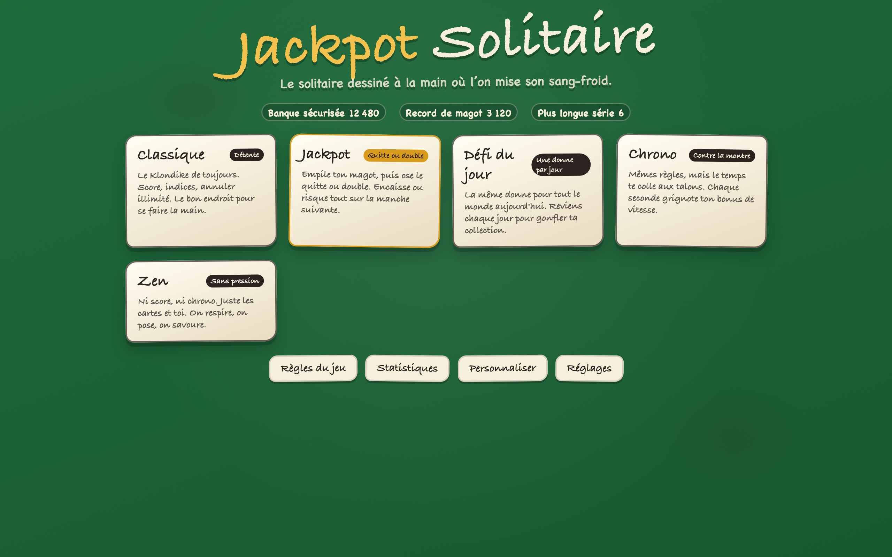
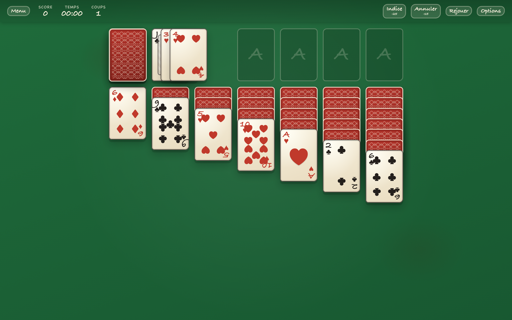
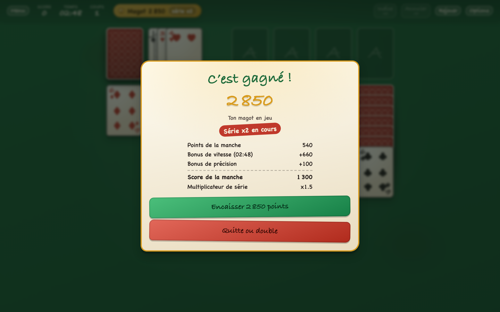
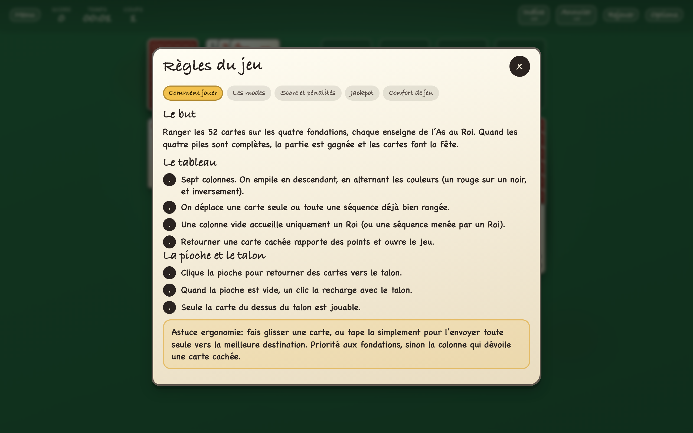
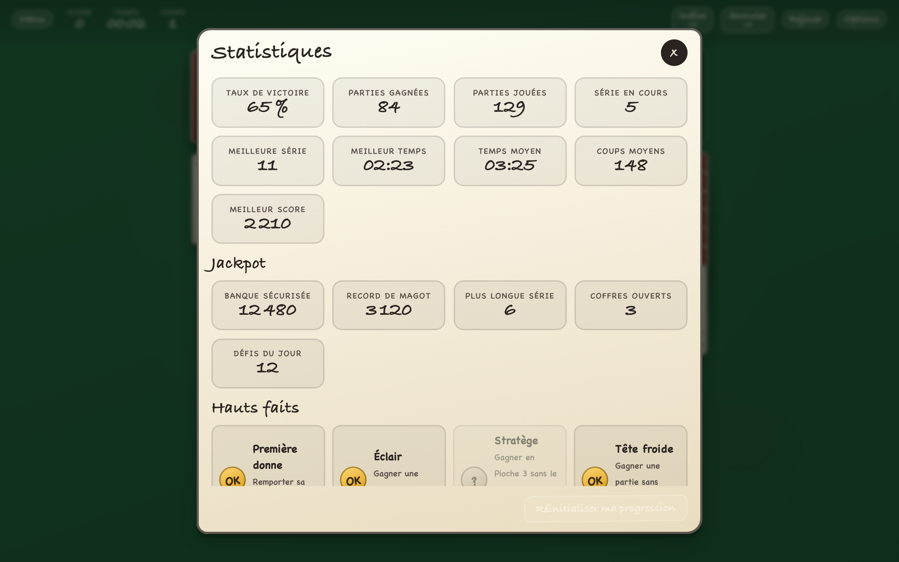
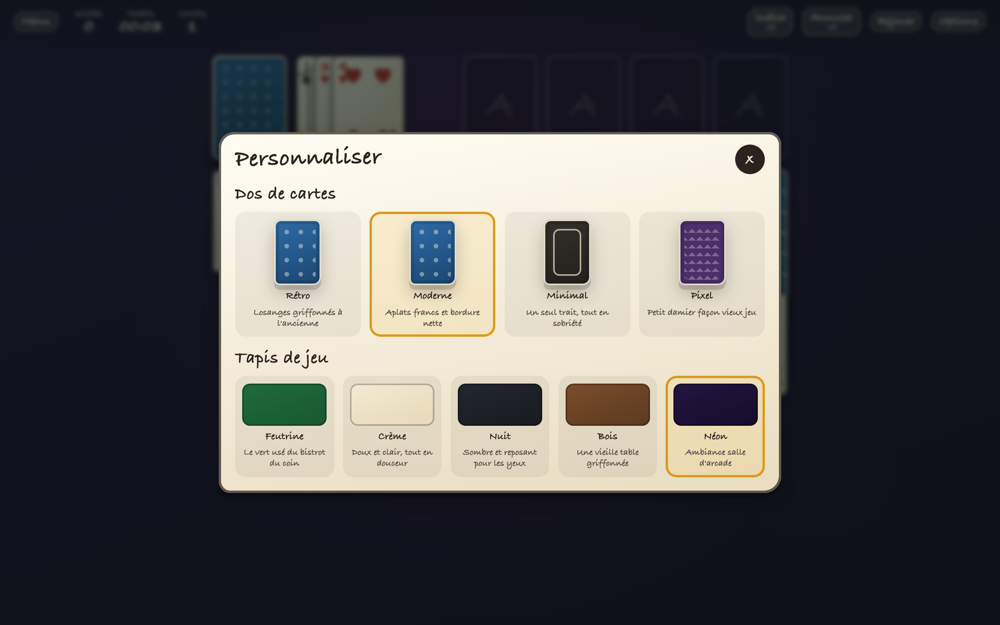
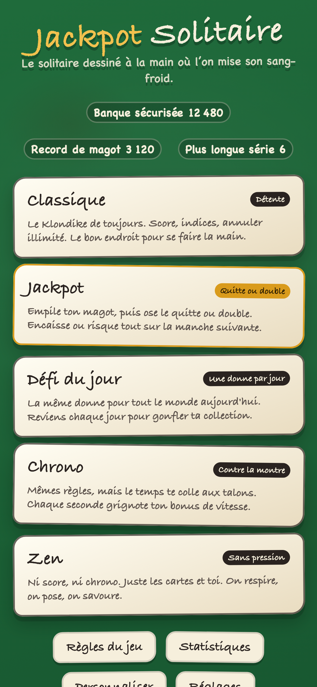

# Jackpot Solitaire

Un Solitaire (Klondike) dessiné à la main, plein de caractère, avec un vrai
grain de folie: une banque de points façon casino et un mode quitte ou double
où l&rsquo;on mise son sang-froid.

L&rsquo;idée de départ est simple: c&rsquo;est un Solitaire. Mais le soin
apporté au ressenti de jeu, aux animations, aux sons faits maison et au
système de mise en fait tout autre chose qu&rsquo;un énième jeu de cartes
générique.



## Sommaire

- [Ce qui rend le jeu attachant](#ce-qui-rend-le-jeu-attachant)
- [Aperçu](#aperçu)
- [Les modes de jeu](#les-modes-de-jeu)
- [Le système de score et de gambling](#le-système-de-score-et-de-gambling)
- [Direction artistique](#direction-artistique)
- [Démarrage rapide](#démarrage-rapide)
- [Scripts disponibles](#scripts-disponibles)
- [Architecture du code](#architecture-du-code)
- [Tests](#tests)
- [Intégration et déploiement continus](#intégration-et-déploiement-continus)
- [Régénérer les captures et les icônes](#régénérer-les-captures-et-les-icônes)
- [Vie privée](#vie-privée)
- [Licence](#licence)

## Ce qui rend le jeu attachant

Ergonomie et ressenti:

- Glisser-déposer fluide au pointeur (souris et tactile), avec pile fantôme
  qui suit le doigt.
- Clic ou tape pour un déplacement automatique vers la meilleure destination
  (priorité aux fondations, sinon la colonne qui dévoile une carte cachée).
- Retour visuel de secousse et petit malus flottant sur un coup impossible.
- Animation d&rsquo;apparition des cartes façon livre pop-up à la
  distribution.
- Cartes qui rebondissent à la victoire, comme au bon vieux temps.
- Sons entièrement synthétisés à la volée (aucun fichier audio), donc
  uniques.
- Thèmes: quatre dos de cartes et cinq tapis de jeu (dont un tout doux, crème).

Confort de jeu:

- Indice quand on bloque, avec mise en avant de la pioche si c&rsquo;est
  elle qu&rsquo;il faut solliciter.
- Annuler illimité.
- Autocomplétion dès qu&rsquo;il n&rsquo;y a plus de suspense (vérifiée par
  simulation, donc jamais proposée à tort).
- Détection de blocage: si la donne devient mathématiquement impossible à
  terminer, le jeu le signale au lieu de laisser chercher dans le vide.
- Pioche 1 (facile) ou Pioche 3 (classique).
- Graine de partie: rejoue une donne précise ou partage-la par un lien
  `?seed=...`.

Progression, gardée en local:

- Tableau de statistiques: taux de victoire, séries, meilleur temps, temps
  moyen, coups moyens, meilleur score.
- Hauts faits à débloquer.
- Records de gambling: plus gros magot sécurisé, plus longue série.

## Aperçu

| Partie en cours | Fin de partie façon casino |
| --- | --- |
|  |  |

| Règles interactives | Statistiques |
| --- | --- |
|  |  |

| Personnalisation | Version mobile |
| --- | --- |
|  |  |

## Les modes de jeu

Toutes les règles sont expliquées dans le jeu, via un panneau interactif à
onglets accessible depuis l&rsquo;accueil (bouton Règles du jeu).

- Classique: le Klondike tranquille. Score, indices et annuler illimité.
- Jackpot: le mode phare. On accumule un magot et on choisit à chaque
  victoire d&rsquo;encaisser ou de tout remettre en jeu.
- Défi du jour: une donne unique, identique pour tout le monde le même
  jour, à ajouter à sa collection mensuelle.
- Chrono: mêmes règles, mais le bonus de vitesse fond à chaque seconde.
- Zen: ni score, ni chrono, ni pénalité. Juste le plaisir de ranger.

## Le système de score et de gambling

Le score récompense la prise de risque et la réflexion:

| Événement | Effet |
| --- | --- |
| Carte posée sur une fondation | +10 |
| Carte cachée révélée | +5 |
| Annuler un coup | -15 |
| Coup impossible | -5 |
| Indice | -25 |
| Recharger la pioche en Pioche 3 | -20 |
| Bonus de vitesse (fin de partie) | max(0, 1000 - secondes x 2) |
| Bonus de précision (0 coup invalide, 0 annuler) | +100 |

En mode Jackpot, chaque manche gagnée grossit le magot. Un multiplicateur de
série récompense les victoires enchaînées (x1, x1.5, x2, x3, puis x5). À
chaque victoire, deux choix:

- Encaisser: le magot rejoint définitivement la banque.
- Quitte ou double: on rejoue aussitôt en risquant tout. Une manche perdue
  ou abandonnée, et le magot retombe à zéro.

Trois victoires de suite en quitte ou double débloquent le coffre-fort
mystère: un multiplicateur surprise appliqué à tout le magot, souvent un
joli gain, parfois un piège. C&rsquo;est ça, le frisson.

## Direction artistique

Le parti pris est assumé: du fait main, pas du tout lisse.

- Cartes en papier crème aux bords légèrement irréguliers, avec un double
  liseret dessiné.
- Pips placés à la main pour les cartes 2 à 10.
- Figures (Valet, Dame, Roi) au trait, qui changent d&rsquo;expression:
  grognon sur un coup interdit, clin d&rsquo;œil quand elles sont montrées
  par un indice.
- Tapis en feutrine avec grain et taches fantômes de café (ou tapis crème,
  bois, nuit, néon).
- Typographie manuscrite, couleurs de gouache.

## Démarrage rapide

Pré-requis: Node 20 ou plus récent.

```bash
npm install        # installe les dépendances
npm run dev        # serveur de développement (http://localhost:5173)
npm run build      # build de production dans dist/
npm run preview    # sert le build de production en local
```

L&rsquo;application est une PWA: elle s&rsquo;installe sur mobile comme sur
ordinateur et fonctionne à 100 % hors ligne après la première visite.

## Scripts disponibles

| Script | Rôle |
| --- | --- |
| `npm run dev` | Serveur de développement avec rechargement à chaud. |
| `npm run build` | Vérifie les types puis produit le build de production. |
| `npm run preview` | Sert le build de production en local. |
| `npm test` | Lance les tests unitaires du moteur (Vitest). |
| `npm run test:watch` | Tests en mode surveillance. |
| `npm run typecheck` | Vérification stricte des types TypeScript. |
| `npm run lint` | Analyse statique ESLint. |
| `npm run format` | Reformate le code avec Prettier. |
| `npm run format:check` | Vérifie le formatage sans modifier. |
| `npm run screenshots` | Régénère icônes et captures (voir plus bas). |

## Architecture du code

Le code est séparé en trois couches nettes, pour que la logique de jeu reste
testable indépendamment de l&rsquo;interface.

```
src/
  engine/      Moteur pur, sans dépendance UI (déterministe, testé)
    types.ts     Modèle de données immuable (Board, Card, Move)
    rng.ts       Générateur pseudo-aléatoire déterministe (seeds)
    deck.ts      Création et distribution du jeu
    rules.ts     Validation des placements et des séquences
    moves.ts     Application des coups, auto-move, indices, autocomplétion,
                 détection de blocage
    scoring.ts   Calcul du score et des bonus de fin de partie
  state/       État applicatif (Zustand)
    game.ts      Partie en cours: coups, annuler, timer, gambling, navigation
    meta.ts      Données persistantes: réglages, stats, banque, hauts faits
    gambling.ts  Règles chiffrées du mode Jackpot
    achievements.ts, themes.ts
  audio/
    sfx.ts       Sons synthétisés à la volée via la Web Audio API
  components/  Interface React
  styles/      Feuilles de style (design system fait main)
  utils/       Formatage du temps, gestion des graines
```

Choix techniques notables:

- Moteur immuable: chaque coup renvoie un nouveau plateau, jamais muté. Cela
  rend l&rsquo;historique d&rsquo;annulation trivial (on empile les états
  précédents) et les tests limpides.
- Graines déterministes: un hash de chaîne alimente un générateur
  mulberry32. Deux graines identiques donnent exactement la même partie, ce
  qui permet le défi du jour et le partage par lien.
- Autocomplétion sûre: proposée uniquement si la partie peut vraiment se
  terminer en n&rsquo;envoyant que des cartes vers les fondations, vérifié
  par une simulation bornée.
- Détection de blocage: la partie est déclarée perdue seulement quand
  aucun coup ne peut plus jamais faire progresser la donne, y compris en
  simulant tous les tirages accessibles via la pioche.

Pile technique: React 18, TypeScript, Vite, Zustand, vite-plugin-pwa, Vitest.

## Tests

Le cœur du jeu (le moteur) est couvert par des tests unitaires: mélange
déterministe, distribution correcte, règles de placement, application et
non-mutation des coups, détection de victoire et de blocage,
autocomplétion, indices et calcul du score.

```bash
npm test
```

## Intégration et déploiement continus

Le workflow GitHub Actions (`.github/workflows/ci.yml`) est déclenché à
chaque push et pull request sur `main`:

1. Vérification du formatage (Prettier).
2. Analyse statique (ESLint).
3. Vérification des types (TypeScript).
4. Tests unitaires (Vitest).
5. Build de production (Vite).

Sur un push vers `main`, et seulement si la passe qualité est verte, le jeu
est build avec la base adaptée au sous-chemin puis déployé automatiquement
sur GitHub Pages.

Pour activer le déploiement: dans les réglages du dépôt, section Pages,
choisir la source GitHub Actions.

## Régénérer les captures et les icônes

Les captures d&rsquo;écran (dossier `screenshots/`) et les icônes PWA
(dossier `public/`) sont générées à partir du vrai rendu du jeu, piloté par
un navigateur headless.

```bash
npm install --no-save playwright
npx playwright install chromium
npm run screenshots
```

Le script lance un serveur de développement, pilote l&rsquo;application
avec Playwright, enregistre les captures et rastérise l&rsquo;icône SVG aux
tailles attendues.

## Vie privée

Aucun compte, aucun serveur, aucun pistage. Statistiques, réglages, banque
et hauts faits sont stockés uniquement dans le navigateur (localStorage).
Rien ne quitte l&rsquo;appareil.

## Licence

Distribué sous licence MIT. Voir le fichier [LICENSE](LICENSE).
